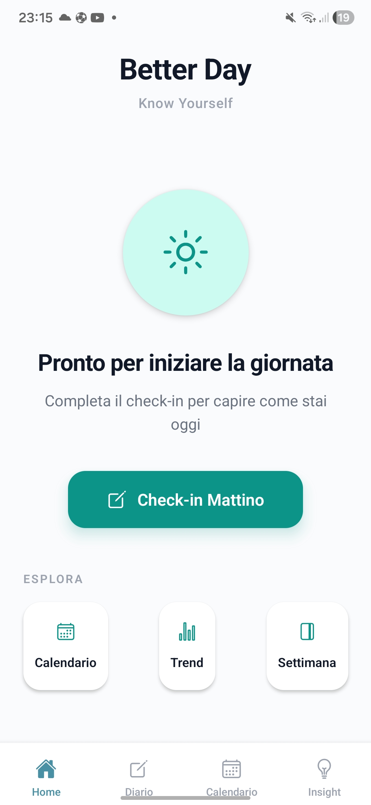
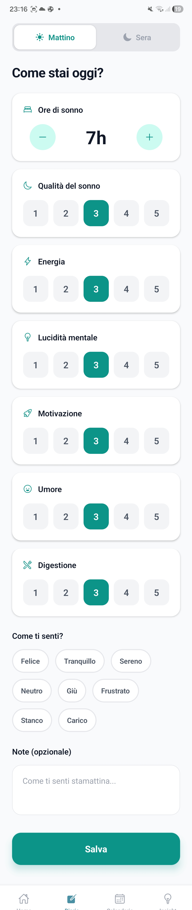

# Better Day

Know Yourself.

Better Day is a simple mobile app designed to help you understand your daily energy, mood and habits through a quick daily check-in.

---

## 📱 App Preview

### Home

### Daily Check-in

---

## 🧠 Why I built this

I wanted something simple.

Not another productivity app.  
Not another habit tracker.

Just a way to quickly understand how I feel every day — and see patterns over time.

So I built Better Day.

---

## ⚙️ What it does

- Quick daily check-in (morning / evening)
- Track sleep, energy, mood and mental clarity
- Simple scoring system (1–5)
- Emotional tagging (how you feel)
- Trends and weekly overview

---

## 🎯 Goal

The goal is not to optimize everything.

The goal is awareness.

Because awareness → better decisions.

---

## 🚀 Tech

- React Native (Expo)
- Simple local state (no backend yet)
- Focus on UX and simplicity

---

## 📌 Status

Work in progress.

Next steps:
- Insights based on patterns
- Smarter feedback system
- Data persistence

---

## 👋

Built by Andrea.  
First version of a personal project focused on awareness and daily self-tracking.
